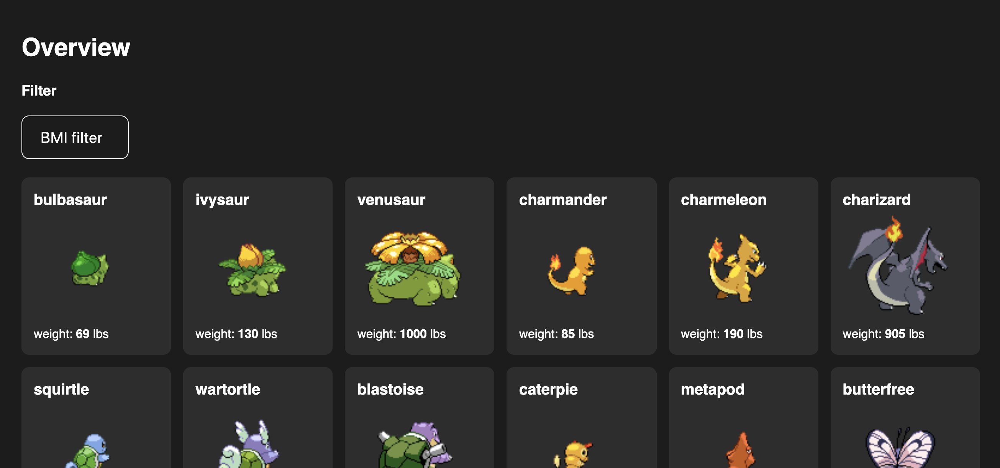
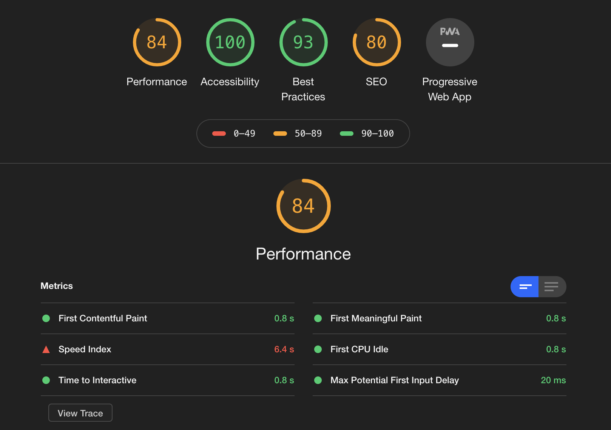
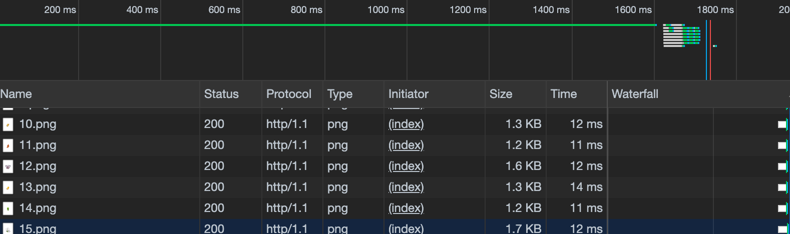
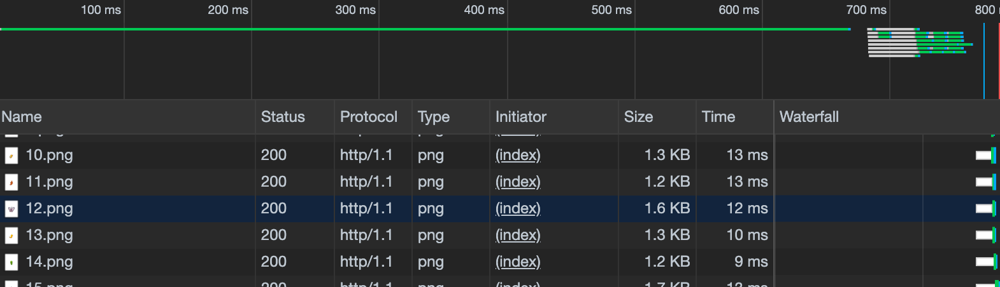
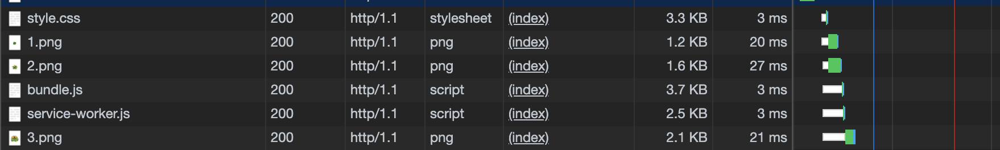
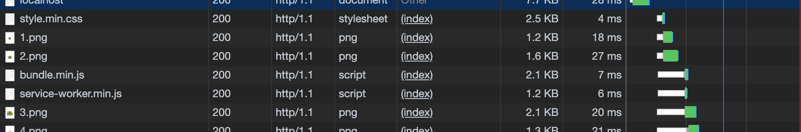
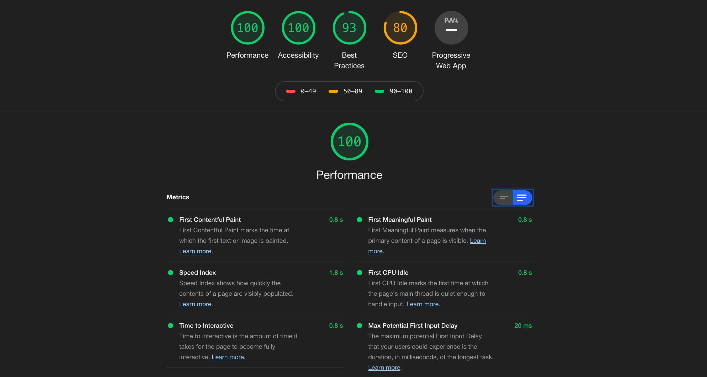

# Performance Matters
Door Jamal van Rooijen

<!-- Add a link to your live demo in Github Pages 🌐-->
[Naar de demo](https://performance-matters-jamal.herokuapp.com/)

---

## Inhoudsopgave
- [Performance Matters](#performance-matters)
  - [Inhoudsopgave](#inhoudsopgave)
  - [App](#app)
    - [API](#api)
    - [Installing](#installing)
  - [Features](#features)
      - [Service Worker](#service-worker)
  - [Optimalisaties](#optimalisaties)
    - [Audit before](#audit-before)
    - [Caching request](#caching-request)
      - [Before caching](#before-caching)
      - [After caching](#after-caching)
    - [Minify code](#minify-code)
      - [Before minify](#before-minify)
      - [After minify](#after-minify)
  - [Conclusie](#conclusie)
    - [Audit after](#audit-after)
  - [Checklist](#checklist)
    - [MIT license 🧾](#mit-license-%f0%9f%a7%be)

---

<!-- ☝️ replace this description with a description of your own work -->
## App
Ik heb nog geen OBA app, dus heb ik mijn WAFS app omgebouwd naar een server side versie. Je vindt hier een overzicht van 20 Pokemon billen.

<!-- What external data source is featured in your project and what are its properties 🌠 -->
 ### API
 Er is gebruik gemaakt van de [PokeApi](pokeapi.co). Een restful API waar je 100 request per minuut mee mag doen. Standaard krijg je 20 Pokemons terug uit de response. Dit kan je zelf handmatig verhogen indien nodig.

<!-- Add a nice image here at the end of the week, showing off your shiny frontend 📸 -->


<!-- How about a section that describes how to install this project? 🤓 -->
### Installing
1. Ga naar je terminal
2. Ga naar de map waar je het project wilt installeren
3. Gebruik de volgende code in je terminal

```
cd /~path
```
```
git clone https://github.com/cmda-minor-web/performance-matters-1819.git
```
```
npm install
```
```
npm run start
```

4. Veel plezier!
   
---

<!-- ...but how does one use this project? What are its features 🤔 -->
## Features
 Je hebt de mogelijkheid te filteren op gewicht en naar een detail pagina te gaan van een geselecteerde pokemon. Het overzicht en de detailpagina werken ook zonder Javascript.

#### Service Worker
De service worker zorgt er ook voor dat de javascript en css worden gecached. Zo blijf je ook de basis stijl zien, zelfs wanneer je niet beschikt over een internet verbinding. Dit houdt natuurlijk niet in de app altijd zonder internet beschikbaar is. Je moet wel minstens een keer mét internet de app bezocht hebben.

 Heb je geen internet? Dan wordt er een 404 pagina gerenderd. Zo weet je in ieder geval waarom de app niet werkt zoals je dat zou willen.
 

---

## Optimalisaties
Hoe performed de web app en wat kunnen we verbeteren?

### Audit before
Door een goed startbeeld te krijgen beginnen we met een audit. We zien meteen al dat er veel te winnen valt op de `Speed Index`.




 ### Caching request
 Om er voor te zorgen dat we alle requests niet telkens opnieuw hoeven te doen, wordt de data opgeslagen en weggeschreven in een `cache.json`. Deze wordt vanuit de server side aangemaakt, zodat deze weer client side gebruikt kan worden. Zo is de laadtijd vele male sneller wanneer de pagina al een keer bezocht is.

#### Before caching
Voordat we de request gecached hebben komen we uit op ongeveer een **laadtijd van 1800ms**. Dit komt voornamelijk omdat we de hele request moeten doen en dit ook opnieuw moeten blijven doen.


#### After caching
Om de laadtijd aanzienlijk te versnellen slaan de hele request op. De request schrijven we weg naar een `cache.json`. Zoals je ziet zorgt dit er voor dat de **laadtijd van 1800ms naar 800ms** springt. Een aanzienlijke verbetering op de laadtijd.


---

### Minify code
De files hier zijn op zichzelf niet zo groot, maar we kunnen wel procentueel zien hoeveel een minify van code kan werken. Wanneer de code base groeit, zal de grootte van de bestanden alleen maar belangrijker worden.

We gaan de style en client side javascript minifiën.

#### Before minify
Voor de minify is `style.css` 3.3KB, `bundle.js` 3.7KB en `service-worker.js` 2.5KB.


#### After minify
Na de minify is `style.css` 2.5KB, `bundle.js` 2.1KB en `service-worker.js` 1.2KB. Dit houdt in dat de files gemiddeld gezien tussen de 40% en 50% kleiner zijn geworden.


---

## Conclusie
Hoe performed de web app na alle optimalisaties? Bij de losse optimalisaties is al te zien dat de laadtijd aanzienlijk sneller is. Maar vertaald zich dat ook door in een nieuwe audit?

### Audit after
Na de optimalisaties zien we meteen dat de score van 84 naar 100 is gegaan. Bij `speed index` zijn we van 6 seconden (rood) naar 2 seconden (groen) gesprongen. De app laad na alle optimalisaties drie keer zo snel!



---

<!-- Maybe a checklist of done stuff and stuff still on your wishlist? ✅ -->
## Checklist
- [x] Service Worker
- [x] Render pages without javascript
- [x] Bundle JS
- [x] Minify JS
- [x] Minify CSS
- [x] Cache JSON response
- [ ] Offline error page (al gehaald bij vorige opdracht)
- [ ] Minify HTML
- [ ] Cache image files
- [ ] Fallback voor Javascript functies

<!-- How about a license here? 📜 (or is it a licence?) 🤷 -->
### MIT license 🧾