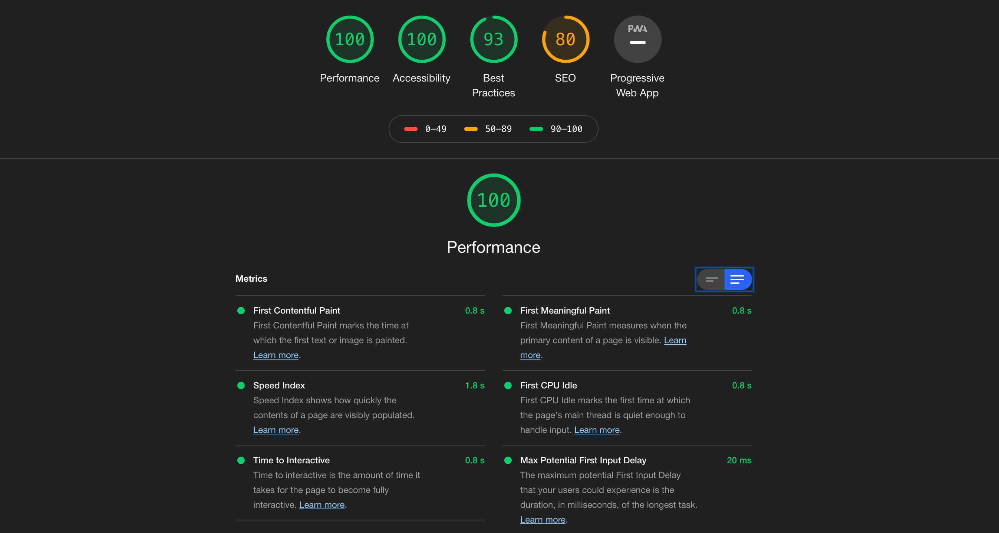

# Performance Matters @cmda-minor-web · 2018-2019
Door Jamal van Rooijen

<!-- Add a link to your live demo in Github Pages 🌐-->
[Naar de demo](#)

<!-- ☝️ replace this description with a description of your own work -->
## App
Ik heb nog geen OBA app, dus heb ik mijn WAFS app omgebouwd naar een server side versie. Je vindt hier een overzicht van 20 Pokemon billen.

<!-- What external data source is featured in your project and what are its properties 🌠 -->
 ### API
 Er is gebruik gemaakt van de [PokeApi](pokeapi.co). Een restful API waar je 100 request per minuut mee mag doen. Standaard krijg je 20 Pokemons terug uit de response. Dit kan je zelf handmatig verhogen indien nodig.

<!-- Add a nice image here at the end of the week, showing off your shiny frontend 📸 -->


<!-- How about a section that describes how to install this project? 🤓 -->
### Installing
1. Ga naar je terminal
2. Ga naar de map waar je het project wilt installeren
3. Gebruik de volgende code in je terminal

```
cd /~path
```
```
git clone https://github.com/cmda-minor-web/performance-matters-1819.git
```
```
npm install
```
```
npm run start
```

4. Veel plezier!

<!-- ...but how does one use this project? What are its features 🤔 -->
### Features
 de mogelijkheid te filteren op gewicht en naar een detail pagina te gaan van een geselecteerde pokemon. Het overzicht en de detailpagina werken ook zonder Javascript. De filterknop werkt dan niet.

#### Service Worker
De service worker zorgt er ook voor dat de javascript en css worden gecached. Zo blijf je ook de basis stijl zien, zelfs wanneer je niet beschikt over een internet verbinding. Dit houdt natuurlijk niet in de app altijd zonder internet beschikbaar is. Je moet wel minstens een keer mét internet de app bezocht hebben.

 Heb je geen internet? Dan wordt er een 404 pagina gerenderd. Zo weet je in ieder geval waarom de app niet werkt zoals je dat zou willen.
 

 #### Caching request
 Om er voor te zorgen dat we alle requests niet telkens opnieuw hoeven te doen, wordt de data opgeslagen en weggeschreven in een `cache.json`. Deze wordt vanuit de server side aangemaakt, zodat deze weer client side gebruikt kan worden. Zo is de laadtijd vele male sneller wanneer de pagina al een keer bezocht is.

##### Before caching


##### After caching


#### Audit


<!-- Maybe a checklist of done stuff and stuff still on your wishlist? ✅ -->
#### Checklist
- [x] Service Worker
- [x] Offline error page
- [x] Render pages without javascript
- [x] Bundle JS
- [x] Minify JS
- [x] Minify CSS
- [x] Cache JSON response
- [ ] Minify HTML
- [ ] Cache image files

<!-- How about a license here? 📜 (or is it a licence?) 🤷 -->
#### MIT license 🧾